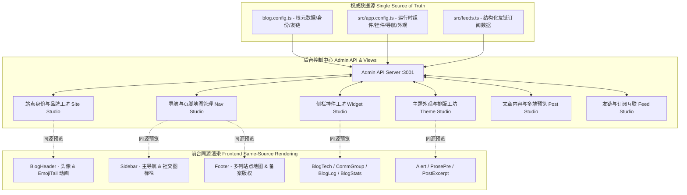

# 全站后台管理系统全面深度重构与前后台高度定制化交付报告

## 一、 重构概述与架构蓝图

本次重构彻底打破了“通用模板式 Admin”与“前台真实页面脱节”的弊病，将整个后台管理系统深度绑定前台架构（React 19 + Rsbuild + MDX + SCSS），实现了**“前台有什么真实功能，后台就能精准管理什么；后台修改什么，前台就能像素级同源反映”**的现代可视化博客控制中心。

---

## 二、 核心重构与功能交付明细

### 1. 导航与页脚地图全景管理 (`NavManagerView.tsx` & `admin-server.ts`)
- **三大管理维度**：
  - **侧边栏主导航 (`nav`)**：支持多分组、菜单项增删改、上移/下移排序、常用预设快速填入与图标选择；
  - **侧栏底部社交与订阅图标 (`iconNav`)**：专门管理前台 Sidebar 最底部常驻的社交图标栏（GitHub、Bilibili、主页、Atom 订阅等）；
  - **页脚站点地图与版权备案 (`footer.nav` & `copyright`)**：支持多列地图分组（如「探索」、「社交」、「信息/备案」）及子链接维护，支持直接编辑页脚 `copyright` 文本；
- **同源高保真双模预览**：
  - 支持在右侧随时切换 **Sidebar 模式**（博主头像 + 主菜单高亮 + 底部社交栏）与 **Footer 模式**（多列地图网格 + 备案号）。

### 2. 主题外观与前台排版工坊 (`ThemeAppearanceView.tsx` & `admin-server.ts`)
- **前台真实组件同源渲染**：
  - **提示框 (Alert)**：卡片风格 (Card) 与扁平风格 (Flat) 切换，即时渲染真实信息框与警告框；
  - **代码块 (Codeblock)**：折叠触发阈值行数、折叠后高度、缩进竖线与 Tab 宽度的即时渲染；
  - **文章开头摘要 (Excerpt)**：打字机动画开关与闪烁光标符号（`_`、`|`、`▋` 等）即时动画预览；
  - **分页与精选轮播 (Pagination & Slide)**：单页文章容量、默认排序与无字封面标题浮层设置。

### 3. 侧栏挂件工坊 (Widget Studio) 深度定制与页面排布联动 (`WidgetManagerView.tsx`)
- **5 大挂件面板深度配置**：
  - **技术信息指标 (Services)**：部署平台、存储服务、开源协议等指标项增删改排；
  - **构建技术栈矩阵 (TechStack)**：技术栈名称、版本号与图标；
  - **社区交流群 (CommGroup)**：群名称、群号、图标、背景图；
  - **更新动态日志 (BlogLog)**：大事记与更新时间轴维护；
  - **博客统计挂件 (BlogStats)**：出生/建站年份与全站字数文案自定义；
- **全场景图标选择器**：全面接入 `IconPickerModal`（云服务、前端框架、社交媒体、开源协议等），支持调色器；
- **页面排布与实时堆叠预览**：切换首页、归档、文章、友链页面，右侧即时渲染该页面激活的所有前台真实挂件。

### 4. 站点身份、头像与 EmojiTail 背景飘动工坊 (`SeoManagerView.tsx`)
- 头像支持本地拖拽、URL、GitHub、QQ 一键提取；
- 头像背景浮动表情动效序列 (`emojiTail`) 可视化增删排序；
- 提供同源真实 `BlogHeader` 动效预览与 OpenGraph 1200×630 社交分享图设计器。

### 5. 彻底统一全站博主头像与身份数据源
- 消除过去写死 `/avatar.png` 导致的空白与破图，全站（侧边栏 Brand Logo、仪表盘欢迎横幅）统一消费 `/avatar.webp` 与博主信息，具备平滑降级兜底能力。

---

## 三、 重构修改文件清单

| 文件 | 变更说明 |
| :--- | :--- |
| [`src/admin/views/NavManagerView.tsx`](file:///c:/Users/Kerntau/Desktop/blog-v3/src/admin/views/NavManagerView.tsx) | 全面重写，支持侧栏主菜单、底部社交图标、页脚站点地图与双模同源预览 |
| [`src/admin/views/ThemeAppearanceView.tsx`](file:///c:/Users/Kerntau/Desktop/blog-v3/src/admin/views/ThemeAppearanceView.tsx) | 全面重写，支持提示框风格、代码块排版、摘要打字动画与组件同源预览 |
| [`src/admin/views/WidgetManagerView.tsx`](file:///c:/Users/Kerntau/Desktop/blog-v3/src/admin/views/WidgetManagerView.tsx) | 挂件工坊深度定制，全场景接入图标选择器、调色器与前台挂件同源渲染 |
| [`src/admin/views/SeoManagerView.tsx`](file:///c:/Users/Kerntau/Desktop/blog-v3/src/admin/views/SeoManagerView.tsx) | 站点身份与头像 Emoji 品牌工坊 |
| [`src/admin/views/DashboardView.tsx`](file:///c:/Users/Kerntau/Desktop/blog-v3/src/admin/views/DashboardView.tsx) | 统一博主头像与昵称数据源，增强运行状态呈现 |
| [`src/admin/AdminApp.tsx`](file:///c:/Users/Kerntau/Desktop/blog-v3/src/admin/AdminApp.tsx) | 统一侧边栏头像数据源与分类导航结构 |
| [`scripts/admin-server.ts`](file:///c:/Users/Kerntau/Desktop/blog-v3/scripts/admin-server.ts) | 扩充 `/api/nav`、`/api/appearance`、`/api/widgets`、`/api/site-info` 原子化读写接口 |
| [`src/admin/types.ts`](file:///c:/Users/Kerntau/Desktop/blog-v3/src/admin/types.ts) | 补齐全套导航、主题外观、挂件与站点信息接口声明 |
| [`src/admin/api.ts`](file:///c:/Users/Kerntau/Desktop/blog-v3/src/admin/api.ts) | 封装客户端 API 请求方法 |
| [`src/app.config.ts`](file:///c:/Users/Kerntau/Desktop/blog-v3/src/app.config.ts) | 规范统一全站配置与运行时数据结构 |

---

## 四、 全量质量与编译验证结果

1. **TypeScript 静态类型检查 (`pnpm tsc --noEmit`)**：
   - 结果：**通过（0 错误，0 警告）**
2. **全量静态预编译构建 (`npx tsx scripts/build-static.ts`)**：
   - 结果：**通过（54 篇 MDX 文章 100% 成功预编译，atom.xml / friends.opml / stats.json / search.json 正常输出）**
3. **后台 API 读写与原子持久化校验**：
   - `GET/POST /api/nav`：通过
   - `GET/POST /api/appearance`：通过
   - `GET/POST /api/widgets`：通过
   - `GET/POST /api/site-info`：通过

<!-- GOAL_COMPLETE -->
